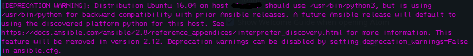

class: center, middle

# Ansible metodą prób i błędów
## Czyli wprowadzenie do Ansible na przykładzie wdorożenia w Fast White Cat

---
.left-column[

### O mnie
]
.right-column[

``` yaml
---
- Speaker:
    Name:     Adam Hyski
    Twitter:  @AdamHyski
    Page:     https://hyski.pl
    Mail:     adam@hyski.pl

```
]
---
name: Agenda
.left-column[
### O mnie
### Nomenklatura
]
.right-column[
- ### Czym jest Ansible?
- ### jak go używać [//]: TODO
- ### jak nie używąć [//]:  TODO
]
---

class: center, middle

# Czym jest Ansible?


---
### Playbook

Najprostszy przykład playbooka:
`./task1.yml`
``` yml
---
- host:       demo
  tasks:
  - name:     Change hostname
    hostname:
      name:   demo.hyski.pl

```
???
czym są taski a czy playbooki
--
wymaga on jeszcze pliku `./hosts.ini`
``` ini
demo.hyski.pl
```
--
ale można lepiej `./hosts.yaml`
``` yaml
all:
  hosts:
    demo.hyski.pl
```
---
# Komputer powiedział „nie”
## Dlaczego?
--

.center[Nie ma pythona 🐍]

---
# Jak sobie z tym poradziłem?
wyciąg z jednego z pierwszych playbooków:

``` yaml
---
- host:           demo
  gather_facts:   False

  pre_tasks:
  - name:         Install python for Ansible
    raw:          test -e /usr/bin/python || (apt -y update && apt install -y python-minimal)
    register:     output
    changed_when: output.stdout != ""
    tags:         always
  - setup:        # aka gather_facts

  tasks:
  - name:         Change hostname
    hostname:
      name:       demo.hyski.pl

```
.red[🛑proszę nie używać ]
???
opowiedzieć co to robi  
---
## Z czego to wynika?
za
[Python Clock:](https://pythonclock.org/)
```
Python 2.7 will not be maintained past 2020.
Originally, there was no official date.
Recently, that date has been updated to January 1, 2020
```
???
- jak działa Ansible po stronie servera  
--
#### Mamy też ładny komunikat jak bymśmy dalej próbowali tego używać
 [//]: TODO

---
## To jak należy to zrobić?
`./task1.yml`
``` yml
---
- host:       demo
  tasks:
  - name:     Change hostname
    hostname:
      name:   demo.hyski.pl

```

`./hosts.yaml`
``` yaml
all:
  hosts:
    demo:
      ansible_host: demo.hyski.pl
      ansible_python_interpreter:  /usr/bin/python3

```

--
#### Można tu też dodać użytkownika
`ansible_user: ubuntu`
???
Jak poradzić sobie w firmie gdzie mamy loginy imienne?
Elastyczna konfiguracja.
--


`export ANSIBLE_REMOTE_USER=adam.hyski`
---

class: center, middle

# Playbooki
---
## Jak wyglądają
`./task2.yml`
``` yml
---
- host:       demo
  tasks:
  - name:     Change hostname
    hostname:
      name:   demo.hyski.pl
  - name:     Install htop
    package:
      name:   htop
      state:  present

```
--
### alternetywnie
``` yml
- name:                Innstall htop
  apt:
    update_cache:      yes
    cache_valid_time:  3600
    name:              htop
    state:             latest
```
???
- czemu nie polecam package
- jak to będzie wykonywane
- co jeśli któryś się wysypie? a się wysypie
---
## Struktura plików
### Za Ansible Docs Best Practices
``` ls
production        # inventory file for production servers
staging           # inventory file for staging environment

group_vars/
   group1.yml     # here we assign variables to particular groups
   group2.yml
host_vars/
   hostname1.yml  # here we assign variables to particular systems
   hostname2.yml

library/          # if any custom modules, put them here (optional)
module_utils/     # if any custom module_utils to support modules, put them here (optional)
filter_plugins/   # if any custom filter plugins, put them here (optional)

site.yml          # master playbook
webservers.yml    # playbook for webserver tier
dbservers.yml     # playbook for dbserver tier
roles             # (...)

```
---
## Struktura plików
### Wypracowany kompromis
``` ls
.
├── ansible.cfg                // konfiguracja
├── hosts.yml                  // Host inventories
├── group_vars                 // Group Vars (dir)
├── host_vars                  // Host host_vars (dir)
├── playbooks                  // Playbook (dir)
│   ├── task1.yml   
│   └── task2.yml
├── roles                      // Rules (dir)
└── vault                      // Ansible vault


```
---
## Pętle
``` yaml
- name: remove the nginx and php-fpm package
  package:
    name: "{{ item }}"
    state: absent
  with_items:
    - nginx
    - php7.0-fpm
    - percona-server-server-5.6
```
--
## można bez pętli
``` yaml
- name: remove the nginx and php-fpm package
  apt:
    name:
      - nginx
      - php7.0-fpm
      - percona-server-server-5.6
    state: absent
```
???
Jak już mówiłem apt jest bardziej elastyczne
---

## Pliki

## Szablony
## Zmienne w playbookach
### w host.yaml
### host_vars
### group_vars
---

class: center, middle

# Role
---
## Handlers
mamy taką rolę:
``` ansible
---
# file: roles/common/tasks/main.yml

- name: be sure ntp is installed
  yum:
    name: ntp
    state: present
  tags: ntp

- name: be sure ntp is configured
  template:
    src: ntp.conf.j2
    dest: /etc/ntp.conf
  notify:                     # <-- pojawia się coś nowego
    - restart ntpd
  tags: ntp

- name: be sure ntpd is running and enabled
  service:
    name: ntpd
    state: started
    enabled: yes
  tags: ntp
```
???
Proszę zwrócić uwagę na
notify:
    - restart ntpd
---
## Handlers cd.
plik z handlerem
``` ansible
---
# file: roles/common/handlers/main.yml
- name: restart ntpd
  service:
    name: ntpd
    state: restarted
```
???
- kolejność działania
- kolejność działania handlerów
-
